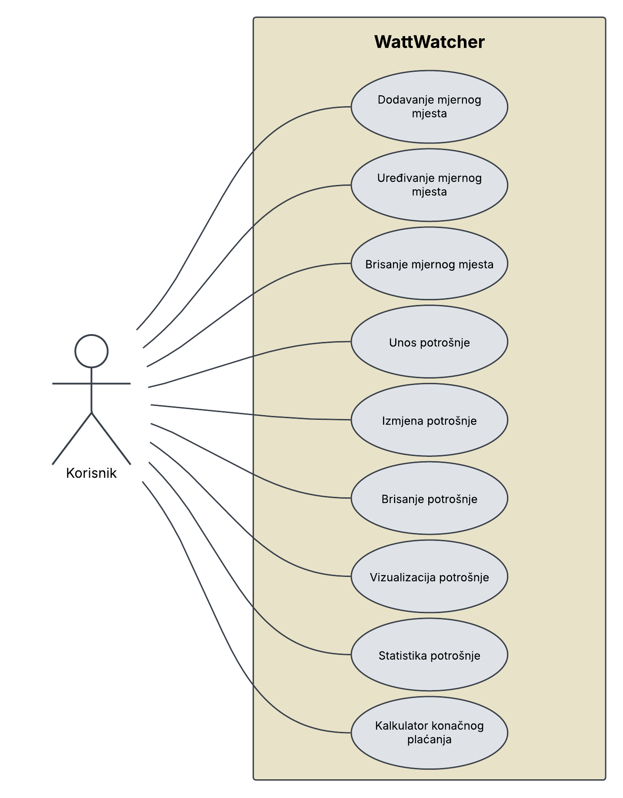

# WattWatcher

**WattWatcher** je web aplikacija za praćenje i analizu potrošnje električne energije.  
Projekt je izrađen u sklopu kolegija *Informacijski sustavi* na Fakultetu informatike u Puli, 1. god., 2. semestar, prijediplomski studij, Sveučilište Jurja Dobrile u Puli.

<br>

# Opis

Aplikacija omogućuje korisnicima:
- vođenje evidencije mjernih mjesta (dodavanje, uređivanje, brisanje),
- unos i pregled mjesečne potrošnje električne energije (viša i niža tarifa) za određeno mjerno mjesto,
- statistiku potrošnje (omjer VT/ukupnoj, ukupni trošak, distribucija, prijenos, itd.),
- vizualizaciju potrošnje za određeno mjerno mjesto kroz mjesece unutar godine pomoću grafikona,
- zračun konačne cijene potrošene električne energije pomoću kalkulatora.

## Funkcionalnosti

- CRUD operacije za mjerna mjesta i potrošnju
- Prikaz i analiza potrošnje po mjesecima
- Statistika i grafički prikaz podataka
- Kalkulator za izračun cijene potrošene električne energije

# Use case



## Instalacija:
<br>

Preuzmite repozitorij s GitHub-a i uđite u direktorij:
```
git clone https://github.com/denisbeletic/WattWatcher.git
```
```
cd WattWatcher
```
<br>


Napravite Docker sliku i pokrenite aplikaciju kroz Docker *(Docker Desktop morate imati upaljen)*:
```
docker build -t wattwatcher .
```
```
docker ps
```
```
docker run -p 8080:8080 wattwatcher
```
<br>

Nakon pokretanja, aplikacija je dostupna na: [http://localhost:8080](http://localhost:8080)